# advanced-css-sass
Course taken from Udemy on Advanced css and Sass. Works related to it are tracked here.

#### Two ways to animate:
1. transition - easy way to do it. Put transition always in the initial state.
2. @keyframes - writing a function to do. more advanced.


## Three Pillars of Writing Good HTML and CSS
- Responsive Design
- Wiriting Maintainable and Scalable code
- Web Performance


#### Responsive Design
 * Fluid layouts
 * Media queries
 * Responsive images
 * Correct units
 * Desktop-first vs mobile-first

#### Maintainable and scalable code
 * Clean
 * Easy-to-understand
 * Growth
 * Reusable
 * How to organize files
 * How to name classes
 * How to structure HTML
 
#### Web performance
 * Less HTTP requests
 * Less code
 * Compress code
 * Use CSS preprocessor
 * Less images
 * Compress images

## How CSS Works!

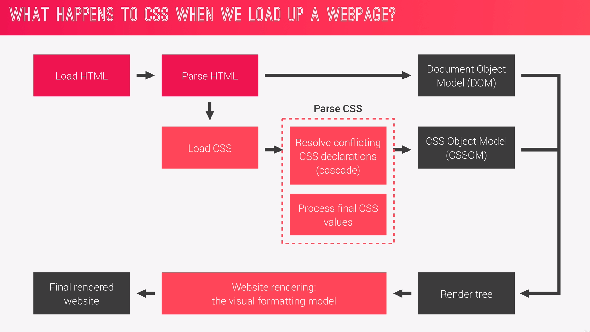

#### CSS Parsing phase!
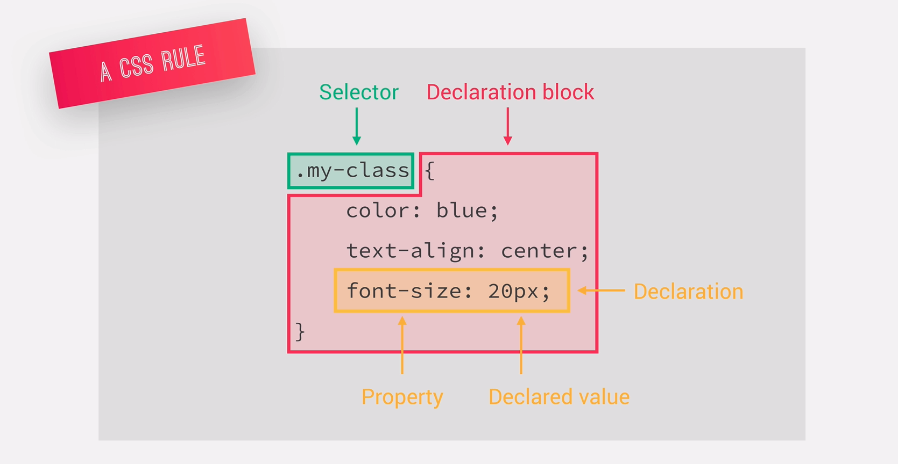

#### The Cascade
> Process of combining different stylesheets and resolving conflicts between CSS rules and declarations,
>when more than one rule applies to a certain element.

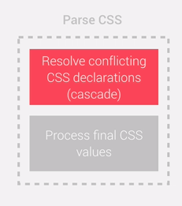

#### Specificity
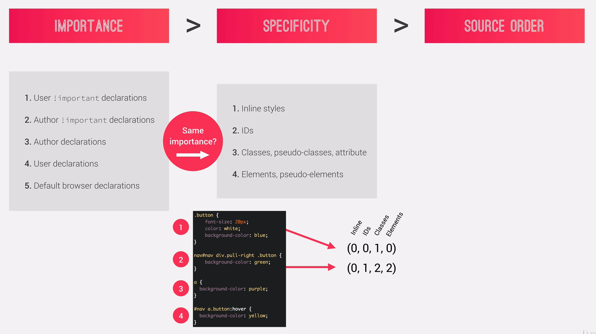
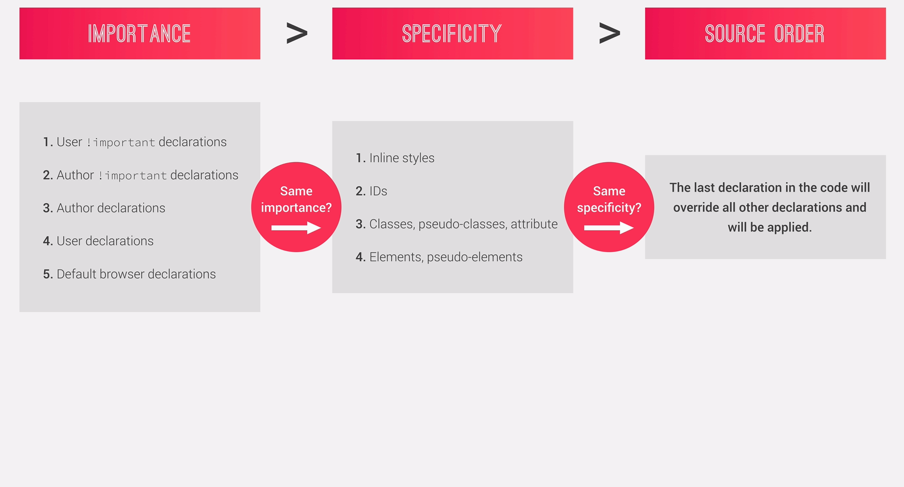
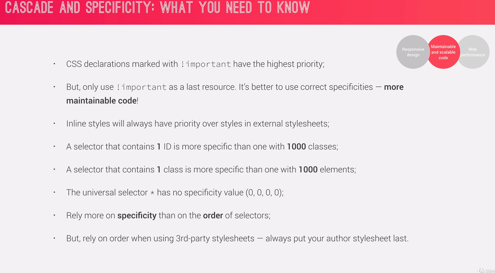


#### CSS Values
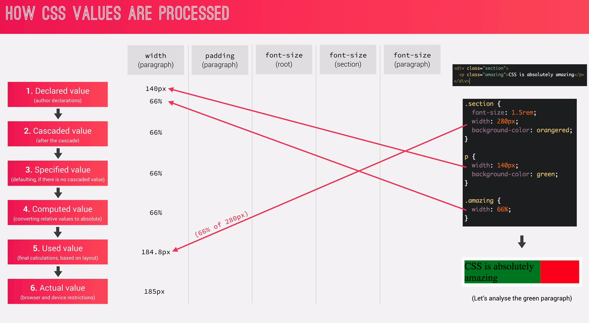
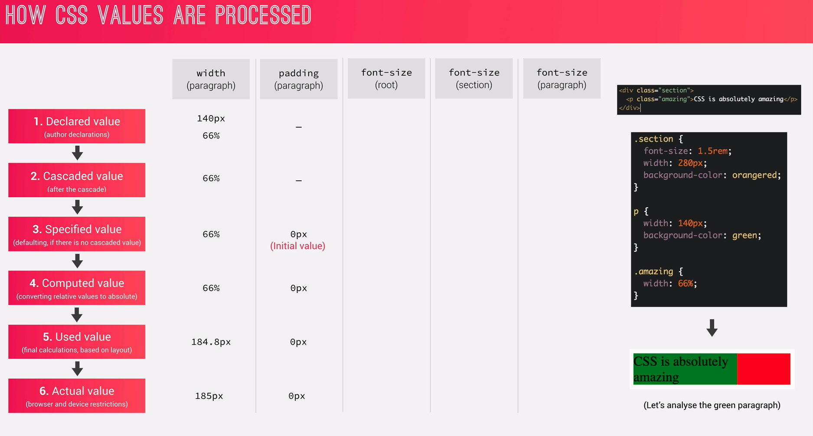
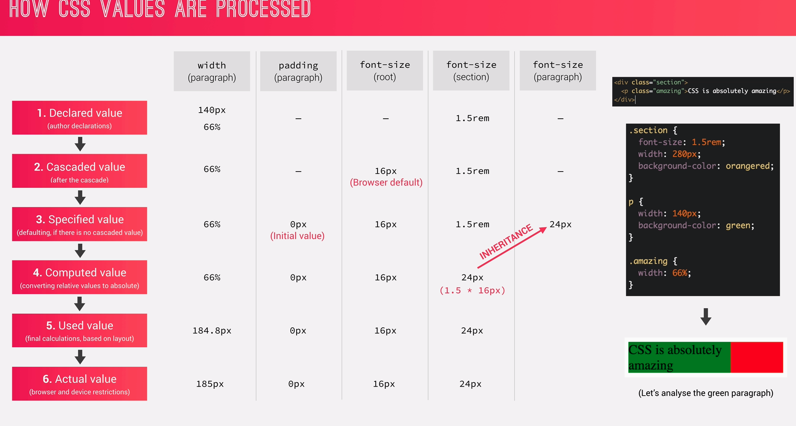


##### How units are converted from relative to absolute (px)?

###### % (fonts)
When Fonts are used in percentage like `font-size: 150%` then it's
**x% * parent's computed font-size** So in our case, 150 * 16px (assuming parent is html/body with root `font-size: 16px`)
which yields **24px** 

###### % (length)
When length are declared in percentage, then it means x% * parent's computed **width**

> Remember with % lengths it's always the computed **width** of parent element.

For ex:
```$xslt
header {
    font-size: 150%;
    padding: 2em;
    marigin-bottom: 10rem;
    height: 90vh;
    width: 1000px
}

.header-child {
    font-size: 3em;
/* Padding will be calculated
* from the parent computed width
*/
    padding: 10%; 
}
```

###### Font-based (em, rem)
em - uses current or parent element for relative reference.
rem -  uses the root element (html) for the relative reference.

* em (fonts):

   Notice the` 3em` on the `font-size` in the `.header-child`,
   so it would take from the parent computed font-size which is **24px (150% * 16)**
   So the result here would be, **72px (3 * 24)** 
* em (lengths):

    Notice the `padding: 2em` on the `.header`, so it would take the
    _current element computed **font-size**_
    So the result would be, **48px (2 * 24)**

    **Takeaway**: 
  * for `em`  **fonts**, it takes from the **parent computed font-size**
  * for `em` **length**, it takes from the **current element computed font-size**


* rem:
 
 `10rem` means, `x * root` computed **font-size** which yields **160px**
 
 * vh:
 
 `1vh` means _1% of the **view-port** height_ so, `90vh` is simply 90% of the view-port height.
 
 (_we may not know length in pixels of the view-port, but the browser painting it knows_)

* vw:

Similarly, for view-port width. `80vw` is **80% of the view-port width.**

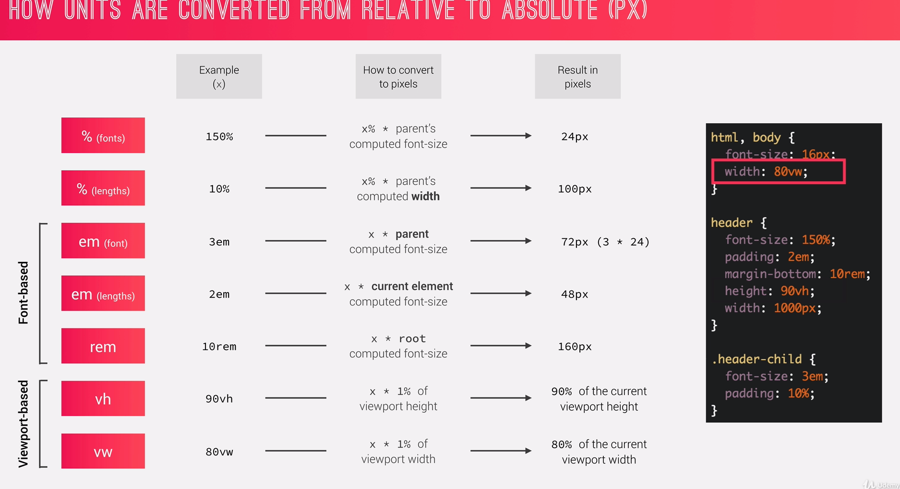


#### CSS Value Processing: What we need to know!
* Each property has an intial value, used if nothing is declared. (and if there is no inhertance).
* Browser specify a root font-size for each page (usually 16px) (so this is a user-agent spec, not from css initial value spec.)
* Percentages and relative values are always converted to pixels
* Percentages -
    * are measured relative to their parent's **font-size**, if used to specify `font-szie;`
    * are measured relative to their parent's **width**, if used to specify lengths.
* em -
    * are measured relative to their **parent** font-size, if used to specify font-size
    * are measured relative to their **current** font size, if used to specify lengths.
   
* rem are always measured relative to **document's root** font size.
* `vh` and `vw` are simply percentage measurements of the viewport's `height` and `width`

#### Inheritance in CSS

> Every CSS property must have a value!

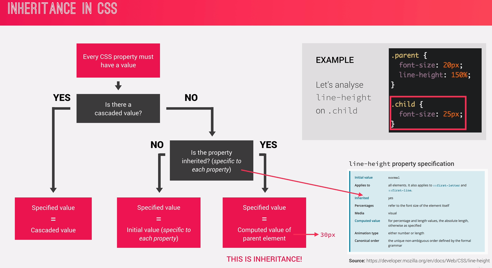

##### What we need to know:
 * Inheritance passed the values for some specific properties from parents to children. -- more maintainable code
 * Properties related to text are inherited!: `font-family, font-size, color etc.`
 * `paddding` and `marigin` is not inherited (for obvious reasons!).
 * The computed value of a property is what gets inherited. **not** the declared value.
 * Inheritance of a property only works if no one declares a value for the property.
 * the `inherit` keyword resets a property to its initial value.
